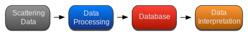

====
Xana
====

Xana is a Python package for data analysis of X-ray scattering data. Originally
designed for X-ray photon correlation spectroscopy (XPCS) data analysis, it also
includes modules for basic X-ray speckle visibility spectroscopy (XSVS) and
small angle X-ray scattering (SAXS) data processing. 

The aim of the development of Xana is to empower experienced and new synchrotron
users to conduct successful XPCS experiments; especially, when measurements with
high repetition rates let the amount of acquired data exceed the TB limit. This
is achieved by separating the actual data processing from the interpretation of
the results (see :ref:`Xana Workflow<basic idea>`). 

.. _basic idea:

    Xana workflow.

Key feature of Xana is a *database* that contains metadata information on the
processed datasets and information on the file where the results were save. Xana
provides additional modules that are capable of aggregating and plotting results
based on the database.

.. toctree::
   :maxdepth: 1
   :hidden:
   :caption: Getting Started

   readme.rst
   modules
..
   getting-started
   

.. toctree::
   :maxdepth: 1
   :hidden:
   :caption: Examples and Tutorials

   XPCS_Example

.. toctree::
   :maxdepth: 1
   :hidden:
   :caption: User Interface

   api.rst

..
   Indices and tables
   ==================

   * :ref:`genindex`
   * :ref:`modindex`
   * :ref:`search`
